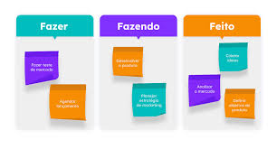
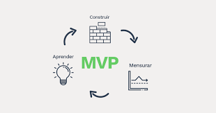
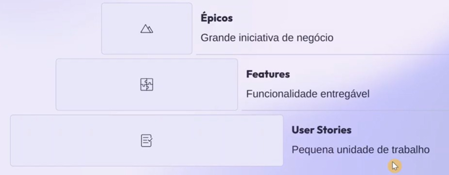
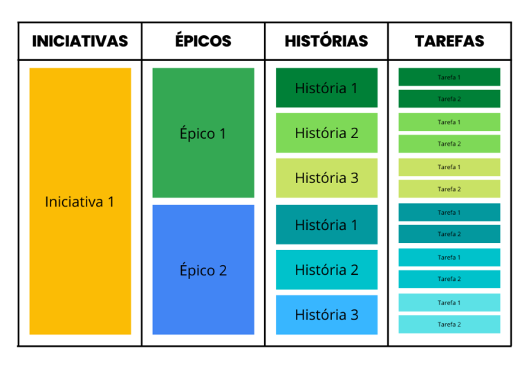

# Método Ágil Quick Guide

>**Assuntos abordados nesse Quick Guide**
>>1. SCRUM
>>2. KANBAN
>>3. MVP
>>4. Hierarquia de trabalho
>>5. Composição de uma boa User Story
>>6. Formato de uma User Story e Critérios de Aceitação

----

<b>1. SCRUM</b>

<figure align="center">
  
  <figcaption>Figura 1: Representação visual do fluxo SCRUM.</figcaption>
</figure>

---

<b>2. KANBAN</b>
<figure align="center">
  
  <figcaption>Figura 2: Representação visual do quadro básico do Kanban.</figcaption>
</figure>

---

<b>3. MVP</b>
<figure align="center">
  
  <figcaption>Figura 3: Representação visual do fluxo básico do MVP.</figcaption>
</figure>

---

<b>4. Hierarquia de trabalho</b>
<figure align="center">
  
  <figcaption>Figura 3: Representação visual da Hierarquia de Trabalho.</figcaption>
</figure>

**A Hierarquia de Trabalho também pode ser representada da forma abaixo**

<figure align="center">
  
  <figcaption>Figura 3: Representação visual da Hierarquia de Trabalho.</figcaption>
</figure>

>>>Fonte: [Iniciativas, Épicos, Histórias e Tarefas](https://blog.agile4growth.com.br/scrum/iniciativas-epicos-historias-e-tarefas/)

---

<b>5. Composição de uma boa User Story</b>

Uma boa prática é aplicar o acronônimo **INVEST**

|Acrônimo|Significado|
|:--|:--|
|**I**ndependent|Deve poder ser desenvolvida em qualquer ordem, sem dependências rígidas com outras user stories|
|**N**egotiable|Deve ser uma base para alinhamento entre Scrum Team e Product Owner|
|**V**aluable|Deve Entregar valor claro ao usuário final e ao negócio|
|**E**stimable|Deve ser possível estimar esforço para concluir|
|**S**mal|Deve ter o tamanho que consiga ser completada em uma sprint|
|**T**estable|Deve ter critérios de aceitação claros que permitam confirmar que está completa|

<b>6. Formato de uma User Story e Critérios de Aceitação</b>

>**Estrutura Padrão de uma User Story**
>> **Como** [tipo de usuário]
>> **Eu quero** [realizar uma ação]
>> **Para que** [obter algum benefício]

>**Exemplo de uma User Story com critérios de aceitação**
>> **Como** gestor de compras,
>> **Eu quero** deferir uma requisição de compra,
>> **Para que** eu possa aprovar rapidamente as aquisições necessárias para minha equipe
>>> **Critérios de aceitação**
>>> - Botão "Deferir" visível apenas para gestores
>>> - Sistema valida permissões antes de aprovar
>>> - Requisição muda status para "Aprovada"
>>> - Solicitante recebe notificação por e-mail
>>> - Histórico registra quem aprovou e quando
